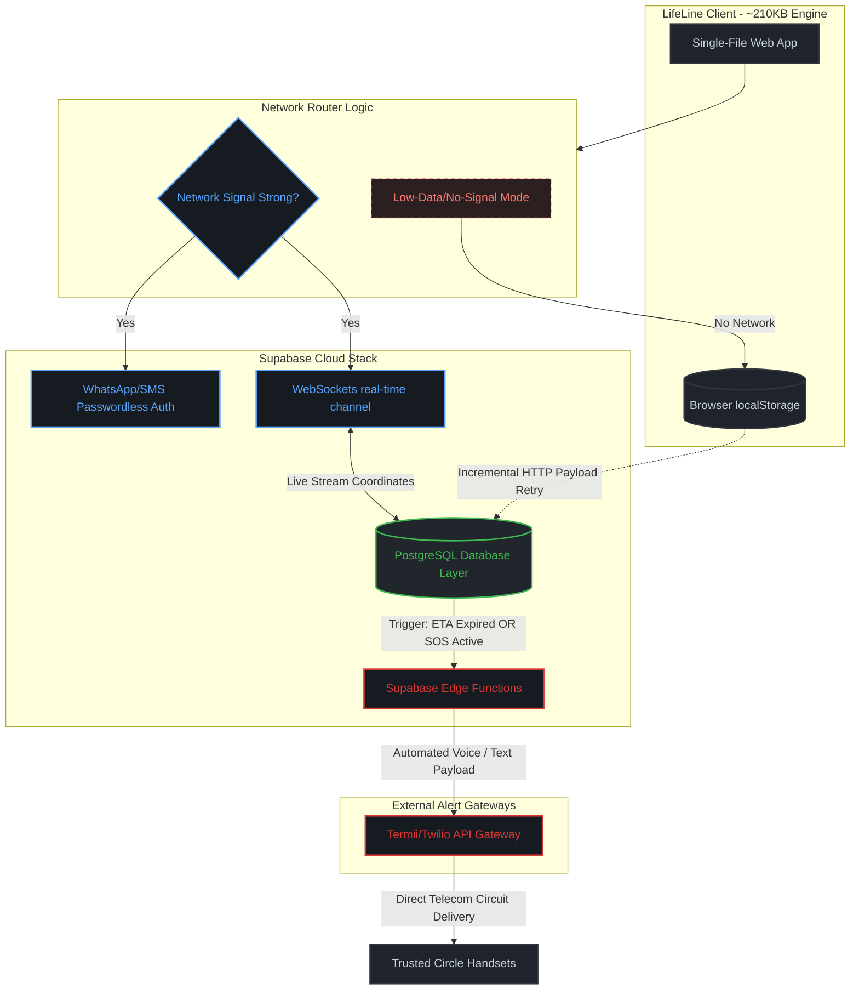

# 🏗️ LifeLine System Architecture (V2 Backend Migration)

Here is our architectural transition map showing how LifeLine preserves low-bandwidth connectivity:

```mermaid
graph TD
    %% Base styling definitions
    classDef client fill:#1f242c,stroke:#30363d,stroke-width:2px,color:#c9d1d9;
    classDef internet fill:#161b22,stroke:#58a6ff,stroke-width:2px,color:#58a6ff;
    classDef edge fill:#161b22,stroke:#da3633,stroke-width:2px,color:#da3633;
    classDef data fill:#21262d,stroke:#3fb950,stroke-width:2px,color:#3fb950;
    classDef offline fill:#2c1f1f,stroke:#ff7b72,stroke-width:1px,color:#ff7b72,stroke-dasharray: 5 5;

    %% Core Components
    subgraph Frontend [LifeLine Client - ~210KB Engine]
        App[Single-File Web App]
        Storage[(Browser localStorage)]
    end
    class App,Storage client;

    subgraph ConnectionState [Network Router Logic]
        GoodNet{Network Signal Strong?}
        BadNet[Low-Data/No-Signal Mode]
    end
    class GoodNet internet;
    class BadNet offline;

    subgraph Backend [Supabase Cloud Stack]
        Auth[WhatsApp/SMS Passwordless Auth]
        Realtime[WebSockets real-time channel]
        DB[(PostgreSQL Database Layer)]
        EdgeFunc[Supabase Edge Functions]
    end
    class Auth,Realtime internet;
    class DB data;
    class EdgeFunc edge;

    subgraph Telephony [External Alert Gateways]
        SMS[Termii/Twilio API Gateway]
    end
    class SMS edge;

    %% Architecture Logic Mapping
    App --> ConnectionState
    
    %% Path A: Optimal Connectivity Flow
    GoodNet -->|Yes| Auth
    GoodNet -->|Yes| Realtime
    Realtime <-->|Live Stream Coordinates| DB
    
    %% Path B: Offline-First Failuresafe Sync Flow
    BadNet -->|No Network| Storage
    Storage -.->|Incremental HTTP Payload Retry| DB

    %% Automated Edge Alert Layer
    DB -->|Trigger: ETA Expired OR SOS Active| EdgeFunc
    EdgeFunc -->|Automated Voice / Text Payload| SMS
    SMS -->|Direct Telecom Circuit Delivery| TrustedContact[Trusted Circle Handsets]
    
    class TrustedContact client;
```
